| Component | Datasheet | Additional Info |
| --- | --- | --- |
| ESP32 | [Datasheet (PDF)](../assets/pdf/ESP32_WROOM.pdf) | |
| Gyroscope GY91 | [Datasheet (PDF)](../assets/pdf/GYRO/GYRO_GY_91.pdf) | |
| (Gyroscope) 9250A Chip | [Datasheet (PDF)](../assets/pdf/GYRO/PS-MPU-9250A-01-v1.1.pdf) | [Register map (PDF)](../assets/pdf/GYRO/RM-MPU-9250A-00-v1.6.pdf) |
| Microphone INMP441 | [Datasheet (PDF)](../assets/pdf/MIC_INMP441.pdf) | |
| RTC | [Datasheet (PDF)](../assets/pdf/RTC_PCF85263A.pdf) | |
| SD Card Module | [Datasheet (PDF)](../assets/pdf/SD.pdf) | |
| Temperature sensor GY906T1 | [Datasheet (PDF)](../assets/pdf/TEMP_GY_906_T1.pdf) | |

```mermaid
flowchart TB
    subgraph Moometer V1
        subgraph M1[Module #1]
            TEMP[Temp\nSensor] --> ESP32
            ESP32((ESP32)) --- TEMP

            RTC[RTC 🕐] ---> ESP32

            Battery ---> ESP32

            ESP32 <--> SD[SD CARD]
        end

        subgraph M2[Module #2]
                direction TB

                MIC[Microphone\n🎤] --> ESP32
                ESP32 --> MIC

                GYRO[Gyroscope\nSensor] --> ESP32
                ESP32 ---> GYRO
        end
    end

    linkStyle 1,3,6,8 stroke:yellow;
    linkStyle 0,2,4,5,7 stroke:blue;
```

